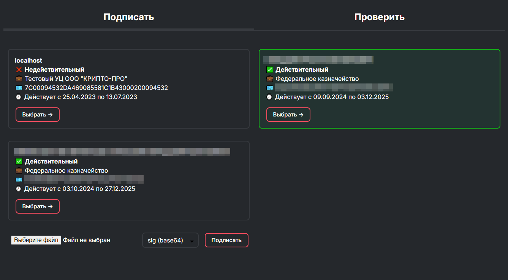
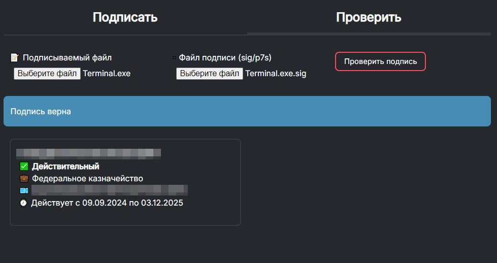

# Создание и проверка подписи (КриптоПро)

Простой проект, позволяющий создавать отделённую ЭЦП файла. Также возможна проверка подписи.

Работает с помощью [КриптоПро ЭЦП Browser plug-in](https://www.cryptopro.ru/products/cades/plugin) ([документация](https://docs.cryptopro.ru/cades/plugin)).

Никакие данные на сервер не отправляются, все операции происходят в браузере.

В данный момент поддерживается одна подпись одного файла.

## Использованные средства

* [cadesplugin_api.js](https://cryptopro.ru/sites/default/files/products/cades/cadesplugin_api.js)
* [Day.js](https://day.js.org)
* [minstyle](https://minstyle.io), [dark-mode-switcher](https://github.com/Airmime/dark-mode-switcher)
* [Inter](https://fonts.google.com/specimen/Inter)